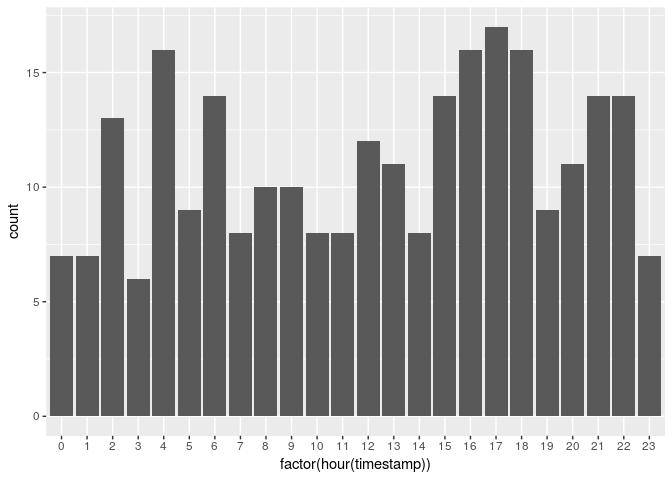
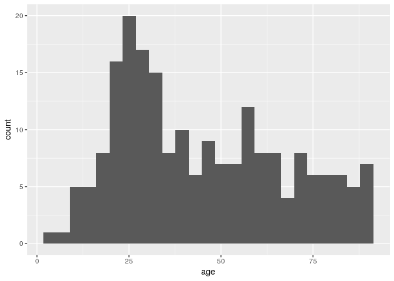
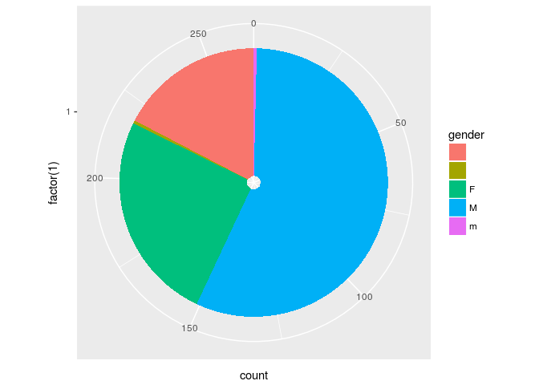
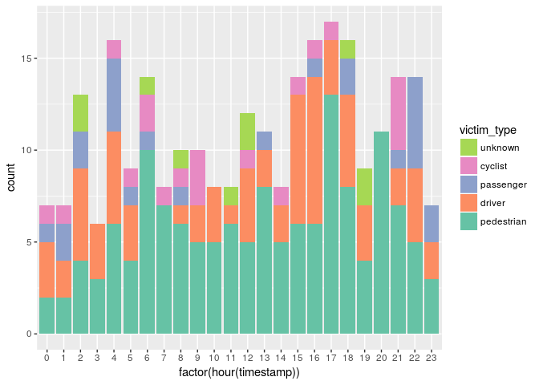
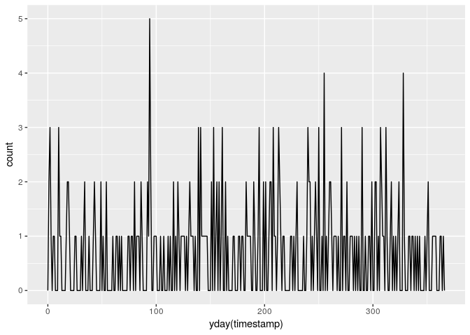
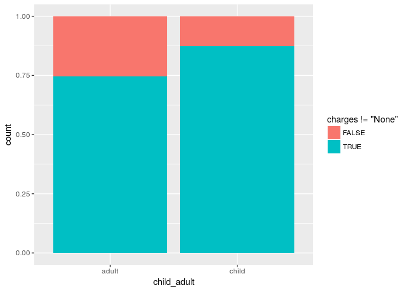

Analyzing the NYC Traffic Death Data
================
Angela Zoss
January 16, 2017

Load R packages and the data
----------------------------

``` r
# load packages; note: if your machine doesn't have these 
# packages installed yet, you can install many of them all at
# once with install.packages("tidyverse").  See also:
# https://github.com/tidyverse/tidyverse

library(dplyr)
```

    ## 
    ## Attaching package: 'dplyr'

    ## The following object is masked from 'package:GGally':
    ## 
    ##     nasa

    ## The following objects are masked from 'package:stats':
    ## 
    ##     filter, lag

    ## The following objects are masked from 'package:lubridate':
    ## 
    ##     intersect, setdiff, union

    ## The following objects are masked from 'package:base':
    ## 
    ##     intersect, setdiff, setequal, union

``` r
library(tidyr)
library(ggplot2)
library(lubridate)

# will need to install this separately; not included in tidyverse
library(RColorBrewer)

# read data in from traffic-deaths.csv, store in a data frame called "df.traffic"
# note that we do not create factors from the strings; we may want factors later,
# but it's often easier to do it ourselves

df.traffic <- read.csv('traffic-deaths.csv', stringsAsFactors = FALSE)
```

Process/clean the data
----------------------

``` r
# process victim_type to convert spaces and empty cells to "unknown"

df.traffic$victim_type <- ifelse(df.traffic$victim_type == " ", "unknown", df.traffic$victim_type)

df.traffic$victim_type <- ifelse(df.traffic$victim_type == "", "unknown", df.traffic$victim_type)

# turn victim_type into a factor, and order the categories by how many accidents
# occurred in each category. "table" counts the accidents in each category,
# "sort" reorders the categories, and "names" takes just the category
# names and discards the counts

df.traffic$victim_type <- factor(df.traffic$victim_type, levels=names(sort(table(df.traffic$victim_type))))


# create a continuous timestamp variable, rather than 
# two string columns that store date and time separately

# first, paste the two columns together with a space in between, then use 
# lubridate to read the date and time information; this produces an
# error on rows where either of the columns is empty

df.traffic$timestamp <- mdy_hm(paste(df.traffic$date," ",df.traffic$time), tz="America/New_York")
```

    ## Warning: 3 failed to parse.

``` r
# an alternative way to do this, without using lubridate

#df.traffic$timestamp <- strptime(paste(df.traffic$date," ",df.traffic$time), "%m/%d/%Y %I:%M %p", tz="America/New_York")


# create a second data frame that removes all rows without a full timestamp;
# this is what we'll use for the analysis

df.fulldate <- subset(df.traffic, !is.na(timestamp))
```

Visualizing variable separately for a quick summary
---------------------------------------------------

### Accidents over time

``` r
# In this plot, we want to summarize the data by month. The bar chart
# will count the number of accidents in each month; we just have to
# tell it how to find the month in the data.  It's easy to pull parts 
# of the timestamp out using lubridate functions like month(). 
# Type ?lubridate for information.

ggplot(df.fulldate, aes(x=month(timestamp, label=TRUE))) + geom_bar()
```


``` r
# This is similar to the previous plot, but now we're pulling out the
# hour of the timestamp.  What do you think factor() is doing here?
# Tip: try the same plot without the factor() command.

ggplot(df.fulldate, aes(x=factor(hour(timestamp)))) + geom_bar()
```



``` r
# Try on your own: plot the number of accidents on different days of the week.
```

------------------------------------------------------------------------

**Save a new version!**

Head back to the [README file](https://github.com/dukevis/mean-streets) for instructions on how to push a new version to your GitHub repository straight from RStudio.

------------------------------------------------------------------------

### Categories of victims

``` r
# In previous plots, we used "geom_bar".  This chart is using "geom_histogram".
# Why might that be?

ggplot(df.fulldate, aes(x=age)) + geom_histogram(bins=25)
```

    ## Warning: Removed 60 rows containing non-finite values (stat_bin).



``` r
# Here is the basic framework for a pie chart, but it could use a lot of help!  
# For starters, try:
#    - fixing the categories to change blank cells to "Unknown"
#    - combine "M" and "m"
#    - specify the order of the wedges in pie chart

ggplot(df.fulldate, aes(x=factor(1),fill=gender)) + geom_bar(position="stack") + coord_polar(theta="y") 
```



Looking for relationships between variables
-------------------------------------------

``` r
# This is the same plot by hour we had above, but now the bars are colored
# according to the victim type.  The final line of the plot overrides the 
# default colors using part of a color palette from the RColorBrewer package.

ggplot(df.fulldate, aes(x=factor(hour(timestamp)))) + geom_bar(aes(fill=victim_type)) + scale_fill_manual(values=rev(brewer.pal(5,"Set2")))
```



``` r
# This plot is often called a "heatmap". It compares the day of the week to the 
# hour of the day to see if there are cycles of accidents.  In ggplot2, heatmaps
# are called bin2d, or a chart with two dimensional binning.  This plot also
# using "theme_bw()" to apply a black and white background theme, instead of the
# grey background with white gridlines.

ggplot(df.fulldate, aes(x=hour(timestamp), y=wday(timestamp, label=TRUE))) + 
  geom_bin2d(binwidth=1) + 
  scale_fill_gradient(low="mistyrose",high="indianred4") + 
  theme_bw()
```


``` r
# What about a line chart that shows the number of accidents each day for the 
# entire year?  Well, it's a bit messy, but here's one way you might make that.

ggplot(df.fulldate, aes(timestamp)) + geom_freqpoly(binwidth=86400)
```


``` r
# Here's another way to make pretty much the same chart.  What are the differences?

ggplot(df.fulldate, aes(yday(timestamp))) + geom_freqpoly(binwidth=1)
```



``` r
# Now, what if we wanted to try to predict whether charges would be filed?
# This code does a few things:
#    - limit the data just to rows where "charges" is not empty
#    - create one bar for adult victims, one for child victims
#    - split the bar into two categories -- one where charges is "None", and 
#      another that includes everything else
#    - have the bars measure percentage instead of count

ggplot(df.fulldate[df.fulldate$charges != "",], aes(x=child_adult,fill=charges!="None")) + geom_bar(position="fill")
```



Try on your own
---------------

-   The charts need a **lot** of help with axis labels, colors, etc.
    New to ggplot2? Check out the cheatsheet under Help --&gt; Cheatsheets
-   What other variables need cleaning?
-   What other variables could be summarized or compared?

Resources
---------

-   [R for Data Science, Hadley Wickham](http://r4ds.had.co.nz/)
-   [Happy Git and GitHub for the useR](http://happygitwithr.com/)
-   [Duke University Libraries' LearnR group](https://github.com/dukevis/learnr/wiki)
-   [Data is Plural Datasets - regularly updated](https://docs.google.com/spreadsheets/d/1wZhPLMCHKJvwOkP4juclhjFgqIY8fQFMemwKL2c64vk/edit#gid=0)
-   [Pro Git Book](https://git-scm.com/book/en/v2)
