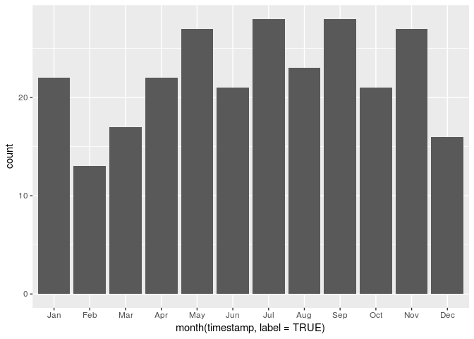
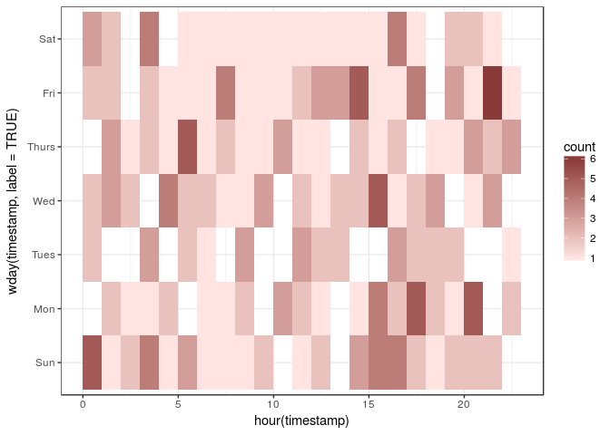

Analyzing the NYC Traffic Death Data
================

Why use GitHub and R?
---------------------

motivate the workshop

describe GitHub, Docker, RStudio, and RProjects

Philosophy of Version Control
-----------------------------

how to decide on when to commit, etc.

Set RStudio up for GitHub
-------------------------

### Configure Git

To send files back to GitHub after you have changed them, you will need to configure RStudio's version of Git with your name and email address.

1.  Go to Tools --&gt; Shell
2.  Type `git config user.name "Your Name"`, inserting your name
3.  Hit Enter
4.  Type `git config user.email "your@emailaddress.com"`, inserting your email
5.  Hit Enter
6.  Click Close

### Fork a GitHub repository

If you want to work on a project someone else has already started, you might want to make a copy of that project under your own GitHub account. That process is called "forking".

1.  Find a repository of interest, e.g., <https://github.com/datanews/mean-streets>
2.  Sign in if not already signed in
3.  Click on the Fork button at the top right-hand corner

### Find the correct URL GitHub Repository URL

1.  Go to the repository you want (either the original or your forked version, if you are forking)
2.  Click on the green "Clone or download" button
3.  Copy the URL from the box that opens

### Connect to the GitHub Repository

1.  Click the project button in the upper right-hand corner of RStudio
2.  Create a New Project
3.  If it asks you to save a file, you can hit Save or Don't Save
4.  Choose "Version Control"
5.  Choose "Git"
6.  Paste in the URL from GitHub (see above)
7.  Create a name for the folder the project will use
8.  Click "Create Project"

### Create the file where the R code and plots will go

This file was created specially to display well in GitHub. It was created with the following steps.

1.  Go to File --&gt; New File --&gt; R Markdown
2.  Click on "From Template"
3.  Scroll down and select "GitHub Document"
4.  Change title
5.  Save file with a meaningful name

### Saving back up to GitHub

Before pushing files to GitHub, you should "Knit" the analysis file by clicking the "Knit" button at the top. This will generate a standard markdown file that can be displayed easily by GitHub. This way, people looking at your files on GitHub will see all of your code and charts properly.

Note: you can only save files back to a repository you own. RStudio will create a project based on any repository on GitHub, but you won't necessarily be able to save back to it. If you want to store your files on GitHub, you should always Fork the repository to your account first.

1.  "Knit" the .Rmd file using the Knit button at the top of the window
2.  Save the .Rmd file and any other files
3.  In the upper right-hand window, click on "Git"
4.  Click "Commit" This basically creates a save point for your files -- something you can go back to later, if you need to.
5.  A new window will try to pop up. If your browser blocks it, authorize the pop-up to appear.
6.  Check the box next to all of the files in the top left-hand area
7.  Type a short message in the top right-hand box describing the changes you're making to the project in this particular upload e.g., "adding analysis file", "changing colors in figures"
8.  After the commit, you still have to "Push" or upload the files up to GitHub. Click the Push button, either in the Commit window or in the normal RStudio window.
9.  When it asks you to log in, use the username and password of the account you used to fork (or create) the repository

Load the data
-------------

``` r
df.traffic <- read.csv('traffic-deaths.csv',stringsAsFactors = FALSE)

# create continuous time variable

df.traffic$timestamp <- strptime(paste(df.traffic$date," ",df.traffic$time), "%m/%d/%Y %I:%M %p")

df.traffic$date <- as.Date(df.traffic$date, format = "%m/%d/%Y")

# load packages; note: on your own machine, you might just want to use the tidyverse package to install all at once

library(dplyr)
```

    ## 
    ## Attaching package: 'dplyr'

    ## The following object is masked from 'package:GGally':
    ## 
    ##     nasa

    ## The following objects are masked from 'package:stats':
    ## 
    ##     filter, lag

    ## The following objects are masked from 'package:lubridate':
    ## 
    ##     intersect, setdiff, union

    ## The following objects are masked from 'package:base':
    ## 
    ##     intersect, setdiff, setequal, union

``` r
library(tidyr)
library(ggplot2)
library(lubridate)

df.fulldate <- subset(df.traffic, !is.na(timestamp))
```

``` r
ggplot(df.fulldate, aes(x=month(timestamp, label=TRUE))) + geom_bar()
```



``` r
ggplot(df.fulldate, aes(x=week(timestamp), y=hour(timestamp))) + geom_bin2d(binwidth=1)
```


``` r
ggplot(df.fulldate, aes(x=hour(timestamp), y=wday(timestamp, label=TRUE))) + geom_bin2d(binwidth=1) + scale_fill_gradient(low="mistyrose",high="indianred4") + theme_bw()
```



Resources
---------

-   <http://happygitwithr.com/>
-   LearnR
-   etc.
-   analysis workflow cheat sheet - just a few simple commands, summary stats?
